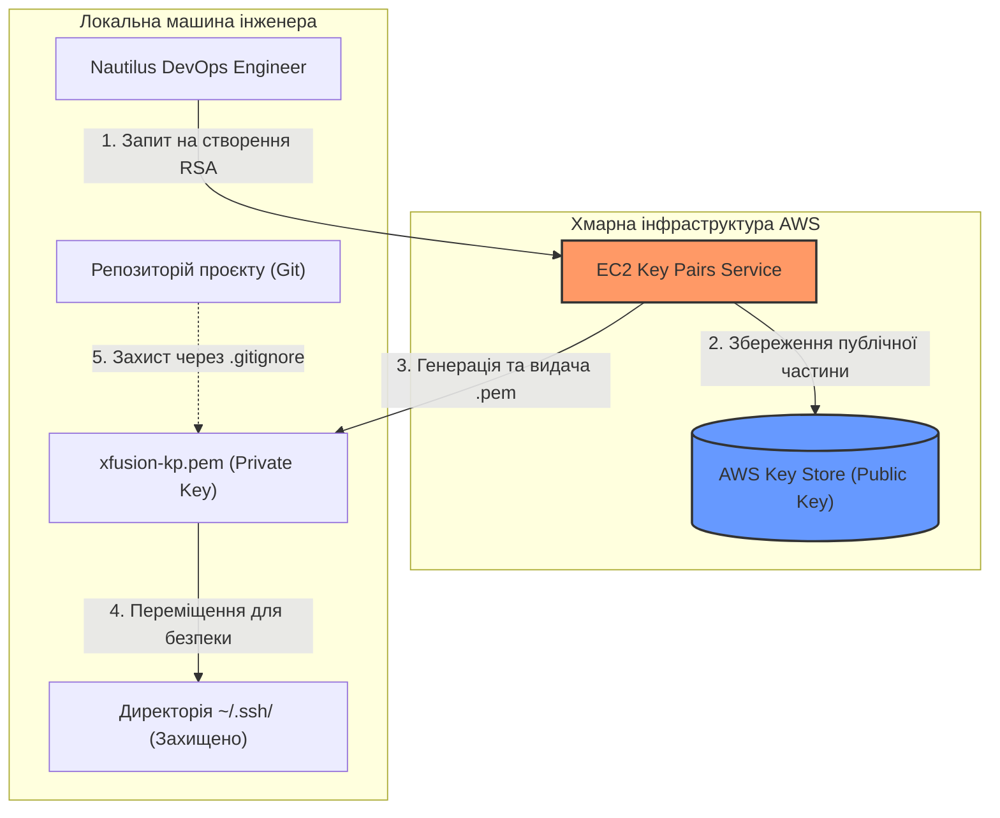

# День 1: Створення пари ключів (Key Pair) 🔑

> **Hook:** Давно мріяв про безпечний доступ до хмари, який не зламає навіть досвідчений хакер?
>
> **Problem-Solution-Value:** Створення ключів — це база, але як зробити це так, щоб Nautilus DevOps не перетворився на вразливу мішень? Ми впроваджуємо RSA Key Pairs з використанням SecOps-підходу: виносимо секрети за межі коду та налаштовуємо "параноїдальні" права доступу. Це дає гарантію, що твої приватні ключі залишаться приватними, а інфраструктура — під твоїм повним контролем.
>
> **Call to Action:** Вивчи наші кроки та заклади фундамент своєї хмарної безпеки вже сьогодні!

## Огляд (Overview)
Пари ключів (Key Pairs) є фундаментальним механізмом для встановлення безпечних SSH-з'єднань з інстансами EC2 в AWS. На цьому початковому етапі міграції Nautilus DevOps ми зосереджуємося на генерації та правильному управлінні цими криптографічними ключами. Окрім простого "створення файлу", ми впроваджуємо **SecOps best practices**: гарантуємо, що приватні ключі зберігаються поза межами системи контролю версій та мають обмежені права доступу у файловій системі.

## Практичні завдання (Practical Tasks)
- [x] Створити пару ключів RSA з назвою `xfusion-kp`.
- [x] Налаштувати політику `.gitignore` для запобігання випадковому витоку секретів.
- [x] Виконати рефакторинг локального зберігання: перемістити ключі у захищену системну директорію (`~/.ssh/`).
- [x] Перевірити права доступу до файлу відповідно до вимог безпеки SSH-клієнтів.

## Архітектура та реалізація (Architecture & Implementation)
Ми використовуємо консоль керування AWS для генерації пари ключів. AWS зберігає **публічний ключ**, тоді як **приватний ключ** завантажується на локальну робочу станцію адміністратора.



## Основні команди (Key Commands - Git Bash)
```bash
# Створення стандартної захищеної директорії (якщо її немає)
mkdir -p ~/.ssh

# Переміщення завантаженого ключа у безпечне місце
# Це тримає репозиторій проєкту чистим від секретів (Stateless)
mv ~/Downloads/xfusion-kp.pem ~/.ssh/xfusion-kp.pem

# Встановлення обмежених прав доступу (тільки для власника)
chmod 400 ~/.ssh/xfusion-kp.pem

# Додавання ключа до списку ігнорування Git (на випадок, якщо він залишився в папці)
echo "xfusion-kp.pem" >> .gitignore
```

## Insights з безпеки (Security Insights) 🛡️
Як Senior DevOps інженери, ми аналізуємо це завдання через призму **AWS Well-Architected Framework**:
- **Security Pillar (Least Privilege):** Сучасні SSH-клієнти (OpenSSH) відхиляють приватний ключ, якщо він має занадто широкі права (наприклад, `644`). Ключ має бути доступним лише для читання власником (`400`).
- **Secret Management:** Зберігання секретів у Git — це критична вразливість. Навіть якщо репозиторій приватний, це збільшує "зону ураження" у разі витоку облікових даних.
- **Persistence:** Оскільки AWS не зберігає приватний ключ після створення, втрата `.pem` файлу означає втрату прямого доступу до інстансів (якщо не налаштовано альтернативи, такі як **SSM Session Manager**).

---
**Наступні кроки:** Готуємось до Day 2: Security Groups! 🚀
