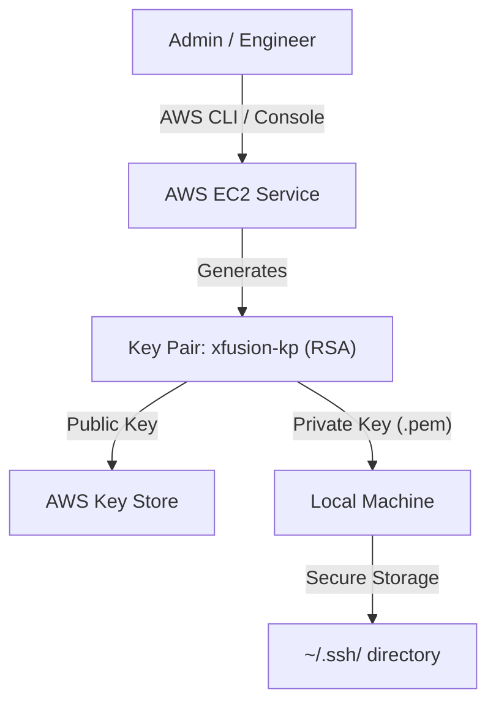

# Day 1: Create Key Pair 🔑

> **Ukrainian Summary:**
> Створення Key Pair — це фундамент безпечного доступу до хмари. Сьогодні ми не просто згенерували файл, а впровадили Security Best Practices: винесли секрети за межі репозиторію та налаштували права доступу. Це перший крок до побудови надійної інфраструктури для Nautilus DevOps.

## Business & Infrastructure Context
- **Why it matters:** Key Pairs are the first line of defense for EC2 instances. Proper management prevents unauthorized access (Security) and ensures that infrastructure remains accessible to legitimate engineers (Operational Continuity).
- **Cost Awareness (FinOps):** Creating Key Pairs in AWS is **free of charge**. However, losing them can lead to indirect costs (downtime, engineer hours for recovery).
- **Operational Domain:**
  - **Environment:** Cloud (AWS)
  - **Layer:** IAM / OS Security
- **The Risk:** Keeping keys in the code repository or having loose permissions (like `777`) results in immediate compromise if the code is leaked or the local machine is breached.

## Lab Breakdown
The task was to create an RSA key pair named `xfusion-kp` for the initial phase of the Nautilus DevOps cloud migration.

### Cloud Architecture


### Step-by-Step Guidance
1. **Key Generation:**
   Created a key pair using the AWS Management Console to ensure immediate visibility of settings.
   
2. **Local Security:**
   # Move the key to the standard SSH directory to keep it outside the codebase
   ```powershell
   # Windows (PowerShell example)
   mkdir ~\.ssh -Force
   mv xfusion-kp.pem ~\.ssh\xfusion-kp.pem
   ```
   *Expected Result:* File is moved to a secure system directory.

3. **Ignore Secrets:**
   # Ensure the key is never tracked by Git
   ```bash
   echo "xfusion-kp.pem" >> .gitignore
   ```
   *Expected Result:* `.pem` files are excluded from `git status`.

## DevOps Context & Alternatives
- **CI/CD:** In automated pipelines, we rarely use static Key Pairs. Instead, we use **IAM Instance Profiles** or **Instance Connect**.
- **Alternatives:** 
  - **EC2 Instance Connect:** Temporary keys pushed via API.
  - **SSM Session Manager:** Access via browser/CLI without needing open port 22 or SSH keys.

## Junior Pitfalls (Помилки джунів ⚠️)
- **Hard-coding keys:** Storing `.pem` files in the Git repo.
- **Loose Permissions:** Leaving the key with `644` permissions, which prevents SSH from connecting for security reasons.
- **One Key for All:** Using the same key pair for Production, Staging, and Dev environments.

## Summary for Interview (Best Practices)
- Always use the **Least Privilege** principle for local file access (chmod 400).
- **White Hat Focus:** Leaving keys in Git is a common entry point for "Credential Harvesting" bots.
- AWS stores the **Public Key**; the **Private Key** is only available at creation. Loss equals loss of direct access.
- Prefer **ED25519** over RSA when possible for better performance and security (though RSA is still the industry standard).

---
**Next Step:** [Day 2: Create Security Groups](./day2) (Coming soon...)
