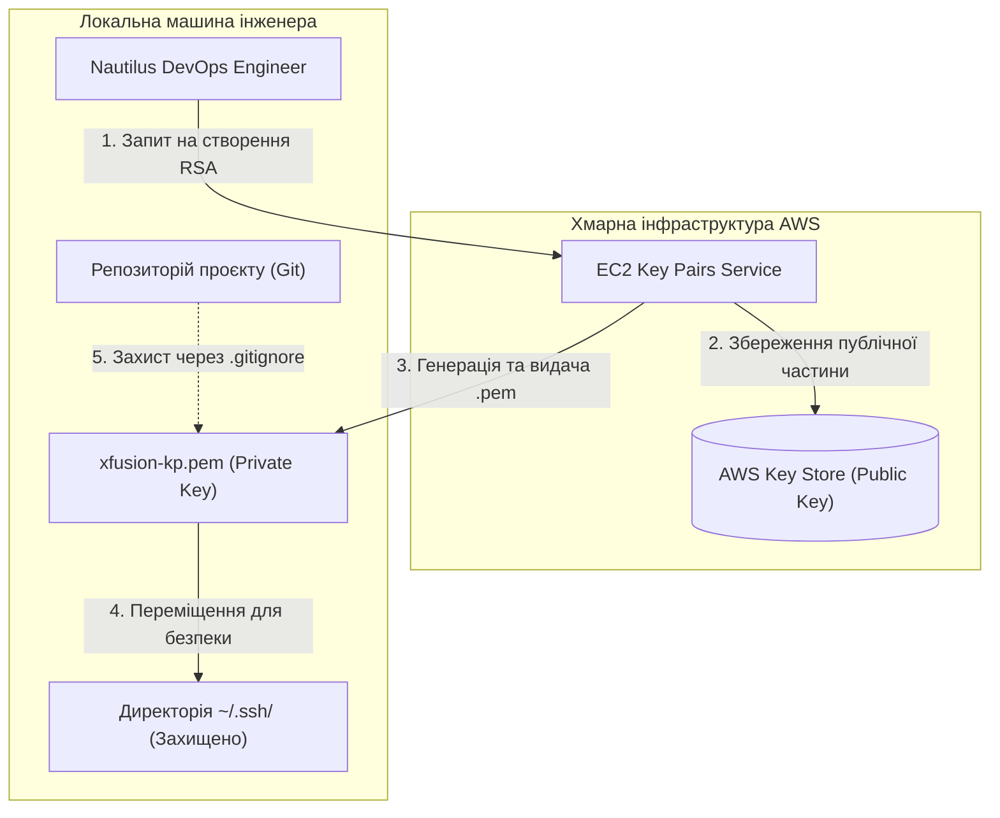

# День 1: Створення пари ключів (Key Pair) 🔑

> **Hook:** Давно мріяв про безпечний доступ до хмари, який не зламає навіть досвідчений хакер? 🕵️‍♂️🔐
>
> **Problem-Solution-Value:** Створення ключів — це база, але як зробити це так, щоб Nautilus DevOps не перетворився на вразливу мішень? Ми впроваджуємо RSA Key Pairs з використанням SecOps-підходу: виносимо секрети за межі коду та налаштовуємо "параноїдальні" права доступу. Це дає гарантію, що твої приватні ключі залишаться приватними, а інфраструктура — під твоїм повним контролем.
>
> **Call to Action:** Вивчи наші кроки та заклади фундамент своєї хмарної безпеки вже сьогодні! Гайд нижче. 👇

## Бізнес та інфраструктурний контекст

### Чому це важливо:
Безпечний доступ до ресурсів — це основа **Security Compliance**. Для бізнесу використання Key Pairs замість паролів означає захист від brute-force атак та можливість чіткого розмежування доступу для різних інженерів. У Nautilus DevOps це критично для забезпечення **High Integrity** під час початкової фази міграції.

### Оптимізація витрат (FinOps):
- **Free Tier:** Створення та зберігання Key Pairs в AWS є повністю безкоштовним.
- **Оптимізація:** Грамотне управління ключами запобігає втраті доступу до інстансів, що економить час інженерів на "злом" власних систем та відновлення даних.

### Операційна область:
- **Середовище:** AWS Cloud / Hybrid Station.
- **Рівень:** Identity and Access Management (IAM) / OS Level.
- **Етап:** Access Provisioning.

### Ризики:
Втрата приватного ключа (`.pem`) — це "гейм овер" для прямого доступу по SSH. Зберігання ключа в публічному репозиторії рівноцінно наданню ключів від квартири всьому інтернету.

## Розбір лабораторної роботи: Безпечне управління RSA ключами

### Архітектура та реалізація (Architecture)
Схема показує шлях приватного ключа від хмари до захищеного сховища.



### Покрокове впровадження

### Крок 1: Створення ключа в AWS Console
Використовуємо інструмент EC2 Key Pairs для генерації пари RSA.

### Крок 2: Локальне загартовування (Hardening)
Ми працюємо в Git Bash (Windows) для налаштування прав.
```bash
# Створення захищеної директорії
mkdir -p ~/.ssh

# Переміщення ключа з Downloads у безпечне місце
mv ~/Downloads/xfusion-kp.pem ~/.ssh/xfusion-kp.pem

# Встановлення прав "Тільки для читання власником"
# Без цього SSH-клієнт відмовиться працювати (Unprotected Private Key file)
chmod 400 ~/.ssh/xfusion-kp.pem
```
**Очікуваний результат:** Команда `ls -l ~/.ssh/xfusion-kp.pem` показує права `-r--------`.

### Крок 3: Захист репозиторію
```bash
# Гарантуємо, що ключі ніколи не потраплять в Git
echo "*.pem" >> .gitignore
```
**Очікуваний результат:** Файли `.pem` стають "сірими" у VS Code та ігноруються Git.

## DevOps контекст та альтернативи
- **Cloud Native:** В сучасних проектах замість SSH-ключів все частіше використовують **AWS SSM Session Manager**, який дозволяє заходити на сервер через браузер/CLI без відкриття порту 22.
- **IaaC:** В Terraform ресурс `aws_key_pair` дозволяє імпортувати ваш існуючий публічний ключ, що є кращою практикою, ніж завантажувати ключі, згенеровані AWS.

## Пастки для джунів (Поширені помилки ⚠️)
- **Repo Leak:** Забутий `.pem` у коміті. Навіть якщо ти його видалиш наступним комітом, він назавжди залишиться в історії Git.
- **Permissions error:** Помилка "Warning: Identity file xfusion-kp.pem unprotected!". SSH вимагає `chmod 400` або `600`.
- **Public Key confusion:** Спроба зайти по SSH, використовуючи публічний (`.pub`) ключ замість приватного (`.pem`).

## Резюме для співбесіди (Best Practices)
1. **RSA 2048/4096:** Використовуйте сучасні стандарти шифрування.
2. **Stateless Keys:** Не зберігайте ключі в папці проєкту. Краще місце — `~/.ssh/`.
3. **No Passwords:** Забороняйте аутентифікацію по паролю в `/etc/ssh/sshd_config`.
4. **Key Rotation:** Періодично оновлюйте ключі для доступу до критичної інфраструктури.
5. **White Hat Insight:** Загублений ключ не означає злом, але вкрадений ключ — це повний контроль над сервером. [Детальніше про безпеку в Day 0](./../day0).

---
**Наступні кроки:** [День 2: Створення Security Group](./../day2) 🚀
