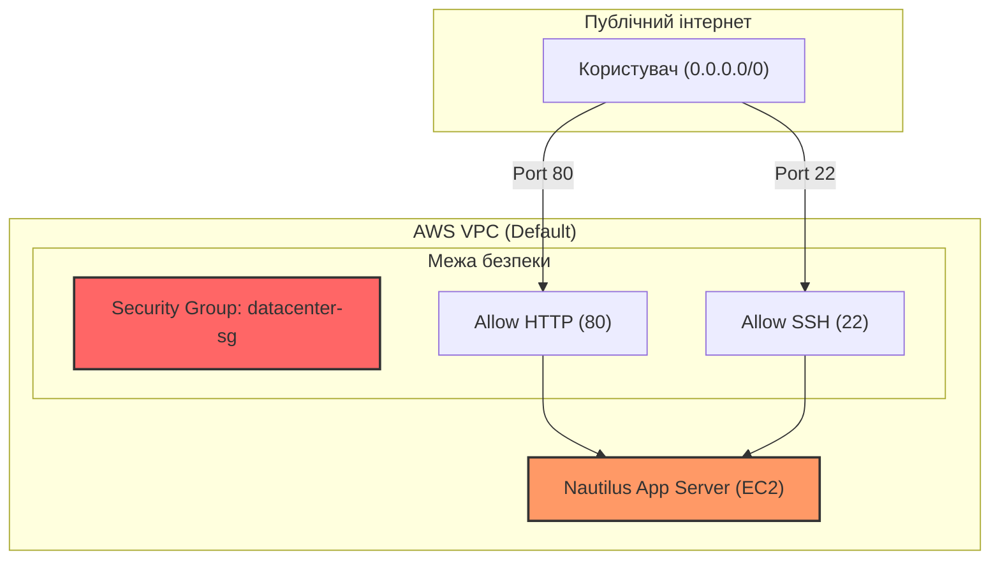

# День 2: Створення групи безпеки (Security Group) 🛡️

> **Hook:** Хочеш, щоб твої сервери були відкриті для світу, але при цьому надійно захищені від "непроханих гостей"?
> **Problem-Solution-Value:** Одна помилка у фаєрволі — і твій сервер стає частиною ботнету. Ми впроваджуємо `datacenter-sg` з чітким розмежуванням трафіку: HTTP для користувачів та SSH для адміністраторів. Це забезпечує баланс між доступністю сервісу та безпекою інфраструктури Nautilus DevOps.
> **Call to Action:** Навчись керувати трафіком на рівні мікросегментації та захисти свій перший хмарний дата-центр!

## Огляд (Overview)
Security Groups (SG) — це віртуальні фаєрволи на рівні інстансів в AWS, які працюють за принципом **Stateful**. У цьому завданні для Nautilus DevOps ми створили групу безпеки `datacenter-sg`, яка дозволяє вхідний трафік для веб-сервера (порт 80) та віддаленого управління (порт 22). Це ключовий елемент стратегії захисту "Defense in Depth".

## Практичні завдання (Practical Tasks)
- [x] Створити групу безпеки `datacenter-sg` у Default VPC.
- [x] Додати Inbound Rule для HTTP (порт 80) з CIDR `0.0.0.0/0`.
- [x] Додати Inbound Rule для SSH (порт 22) з CIDR `0.0.0.0/0`.
- [x] Перевірити коректність опису групи: "Security group for Nautilus App Servers".

## Архітектура та реалізація (Architecture & Implementation)
Ми налаштували SG, яка діє як перша лінія оборони перед EC2 інстансом.



## Основні команди (Key Commands - AWS CLI)
Хоча ми використовували веб-інтерфейс, ось як це зробити через CLI (DevOps-шлях):
```bash
# Створення групи безпеки
aws ec2 create-security-group \
    --group-name datacenter-sg \
    --description "Security group for Nautilus App Servers" \
    --vpc-id vpc-xxxxxxxx

# Додання правила для HTTP
aws ec2 authorize-security-group-ingress \
    --group-name datacenter-sg \
    --protocol tcp --port 80 --cidr 0.0.0.0/0

# Додання правила для SSH
aws ec2 authorize-security-group-ingress \
    --group-name datacenter-sg \
    --protocol tcp --port 22 --cidr 0.0.0.0/0
```

## Insights з безпеки (Security Insights) 🛡️
- **Stateful Nature:** SG автоматично дозволяють зворотний трафік. Якщо вхідний пакет дозволено, відповідь вийде назовні без додаткових правил Outbound.
- **Least Privilege:** Відкриття порту 22 для `0.0.0.0/0` — це ризик. Рекомендується обмежувати доступ лише твоїм IP або використовувати **AWS Client VPN**.
- **Default Outbound:** За замовчуванням SG дозволяють весь вихідний трафік (`0.0.0.0/0`).

---
- **Deep Dive:** [Глибоке занурення в Security Groups](./DEEP_DIVE_SECURITY_GROUPS.md) 🧠
- **Наступні кроки:** Готуємось до Day 3! 🚀
