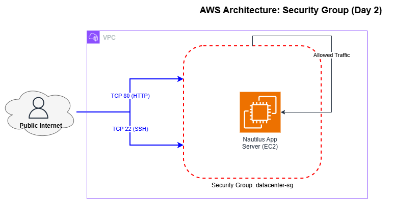

# День 2: Створення групи безпеки (Security Group) 🛡️

> **Hook:** Хочеш, щоб твої сервери були відкриті для світу, але при цьому надійно захищені від "непроханих гостей"? 🏰⚔️
>
> **Problem-Solution-Value:** Одна помилка у фаєрволі — і твій сервер стає частиною ботнету. Ми впроваджуємо `datacenter-sg` з чітким розмежуванням трафіку: HTTP для користувачів (80) та SSH для адміністраторів (22). Це забезпечує баланс між доступністю сервісу та безпекою інфраструктури Nautilus DevOps, мінімізуючи поверхню атаки.
>
> **Call to Action:** Навчись керувати трафіком на рівні мікросегментації та захисти свій перший хмарний дата-центр! Гайд нижче. 👇

## Бізнес та інфраструктурний контекст

### Чому це важливо:
Security Groups — це перша лінія оборони в хмарі. Для бізнесу це означає можливість реалізувати принцип **Micro-segmentation**, де кожен інстанс захищений власним фаєрволом. У контексті міграції Nautilus DevOps, правильна конфігурація SG запобігає несанкціонованому горизонтальному переміщенню (Lateral Movement) зловмисників усередині мережі.

### Оптимізація витрат (FinOps):
- **Free Tier:** Створення та використання Security Groups є безкоштовним.
- **Оптимізація:** Використання SG замість складних платних Third-party фаєрволів на початковому етапі знижує операційні витрати без втрати безпеки.

### Операційна область:
- **Середовище:** AWS Cloud / Default VPC.
- **Рівень:** Network Security (L4 Firewall).
- **Етап:** Infrastructure Hardening.

### Ризики:
Відкриття порту 22 (SSH) для всього світу (`0.0.0.0/0`) створює ризик Brute-force атак. Відсутність SG взагалі призвела б до повної вразливості ресурсів у публічній мережі.

## Розбір лабораторної роботи: Мікросегментація з Security Groups

### Архітектура та візуалізація (Architecture)
Схема віртуального фаєрвола, що захищає EC2 інстанс.



### Покрокове впровадження

### Крок 1: Створення групи безпеки
```bash
# Створення групи з описом для майбутнього аудиту
aws ec2 create-security-group \
    --group-name datacenter-sg \
    --description "Security group for Nautilus App Servers" \
    --vpc-id vpc-xxxxxxxx
```

### Крок 2: Налаштування Inbound Rules
Ми дозволяємо тільки мінімально необхідний трафік.
```bash
# Дозволяємо HTTP для всього світу (Public Web)
aws ec2 authorize-security-group-ingress \
    --group-name datacenter-sg \
    --protocol tcp --port 80 --cidr 0.0.0.0/0

# Дозволяємо SSH (Для демонстрації - для всіх, у продакшені - тільки свій IP)
aws ec2 authorize-security-group-ingress \
    --group-name datacenter-sg \
    --protocol tcp --port 22 --cidr 0.0.0.0/0
```
**Очікуваний результат:** Група `datacenter-sg` створена з двома правилами Ingress.

## DevOps контекст та альтернативи
- **Infrastructure as Code (Terraform):** Ми використовуємо ресурс `aws_security_group_rule` для гранулярного управління правилами як кодом.
- **NACL vs SG:** Security Groups працюють на рівні інстанса (Stateful), тоді як Network ACLs працюють на рівні підмережі (Stateless). У зрілій інфраструктурі ми використовуємо обидва рівні для ефекту "шарованого захисту".

## Пастки для джунів (Поширені помилки ⚠️)
- **Stateful confusion:** Джуни часто намагаються додати "вихідні" правила для відповіді на HTTP-запит. SG — це **Stateful**, вони автоматично дозволяють зворотний трафік.
- **Any-Any-Any:** Створення одного SG для всіх типів серверів (Web, DB, Redis). Кожен рівень має мати свою групу (Least Privilege).
- **Port Conflict:** Забути відкрити порт, на якому реально слухає додаток (наприклад, 8080 замість 80).

## Резюме для співбесіди (Best Practices)
1. **Name tagging:** Завжди додавайте теги для зручного пошуку.
2. **Targeting by SG:** Краще дозволяти трафік з іншої SG (наприклад, "дозволити SQL з Web-SG"), ніж по IP-діапазону.
3. **Egress filtering:** У продакшені обмежуйте і вихідний трафік (наприклад, дозволяйте доступ тільки до репозиторіїв оновлень).
4. **Description is Key:** Кожне правило має мати опис — навіщо воно тут.
5. **White Hat Insight:** Відкритий SSH для світу — це магніт для ботів. Завжди використовуйте `Security Group Referencing` для обмеження доступу. [Детальніше у Deep Dive](./DEEP_DIVE_SECURITY_GROUPS.md).

---
**Попередній день:** [День 1: Створення Key Pair](../day1/README.md)
**Наступний крок:** [День 3: Створення підмережі (Subnet)](../day3/README.md) 🚀
