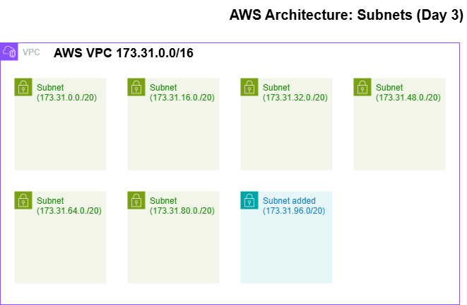

# День 3: Створення підмережі (Subnet) 🌐

> **Hook:** Скільки "квартир" можна створити в одному ІТ-будинку, щоб вони не заважали одна одній?
>
> **Problem-Solution-Value:** Велика мережа (VPC) без підмереж — це хаос. Ми виділили сегмент `nautilus-subnet` (173.31.96.0/20), щоб ізолювати ресурси та підготувати грунт для майбутніх серверів. Це забезпечує структурованість та безпеку на рівні мережевої логіки.
>
> **Call to Action:** Розділяй та володарюй! Навчись сегментувати хмару правильно.

## Огляд (Overview)
Підмережа (Subnet) — це діапазон IP-адрес у вашій VPC. У цьому завданні ми розширили мережеву інфраструктуру Nautilus DevOps, додавши нову підмережу в існуючий Default VPC. Це дозволяє нам розміщувати ресурси в різних Zone Access (AZ) або просто логічно їх розділяти.

## Практичні завдання (Practical Tasks)
- [x] Створити підмережу з назвою `nautilus-subnet`.
- [x] Вибрати Default VPC (`173.31.0.0/16`).
- [x] Призначити IPv4 CIDR блок: `173.31.96.0/20`.
- [x] Перевірити, що підмережа не перетинається з існуючими.

## Архітектура та візуалізація (Architecture)
Тепер наша VPC містить кілька сегментів. Новий сегмент — це "ділянка" на 4096 IP-адрес.



## Основні команди (Key Commands - AWS CLI)
Створення підмережі через термінал:
```bash
# Створення підмережі
aws ec2 create-subnet \
    --vpc-id vpc-xxxxxxxx \
    --cidr-block 173.31.96.0/20 \
    --tag-specifications 'ResourceType=subnet,Tags=[{Key=Name,Value=nautilus-subnet}]'
```

## Insights з мереж (Networking Insights) 🛡️
- **Reserve IPs:** AWS резервує перші 4 та останню 1 IP-адресу в кожній підмережі (наприклад, для Gateway, DNS, Router).
- **Public vs Private:** Підмережа стає "публічною" тільки якщо вона має маршрут (Route Table) до Internet Gateway. За замовчуванням нові підмережі часто потребують додаткового налаштування маршрутизації.

---
- **Deep Dive:** [Як працює CIDR та розбиття на підмережі](./DEEP_DIVE_SUBNETTING.md) 🧠
- **Наступні кроки:** Час запускати інстанси! 🚀
